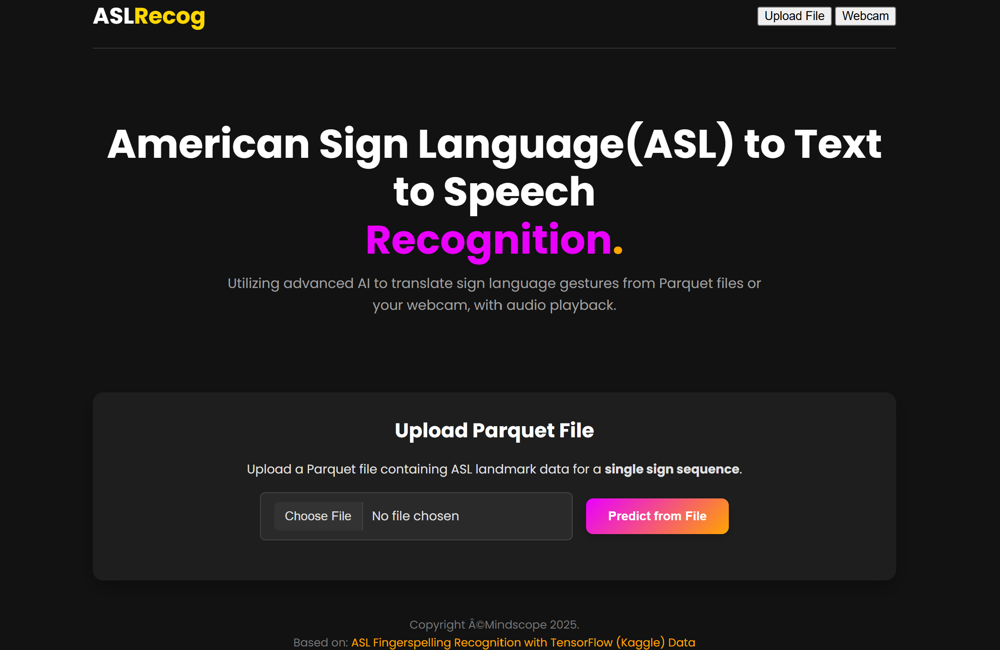
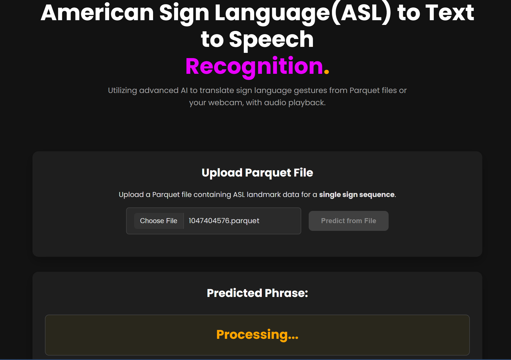
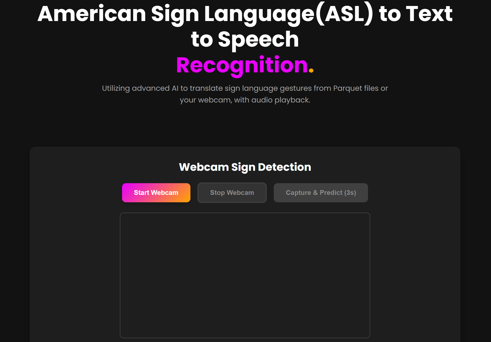
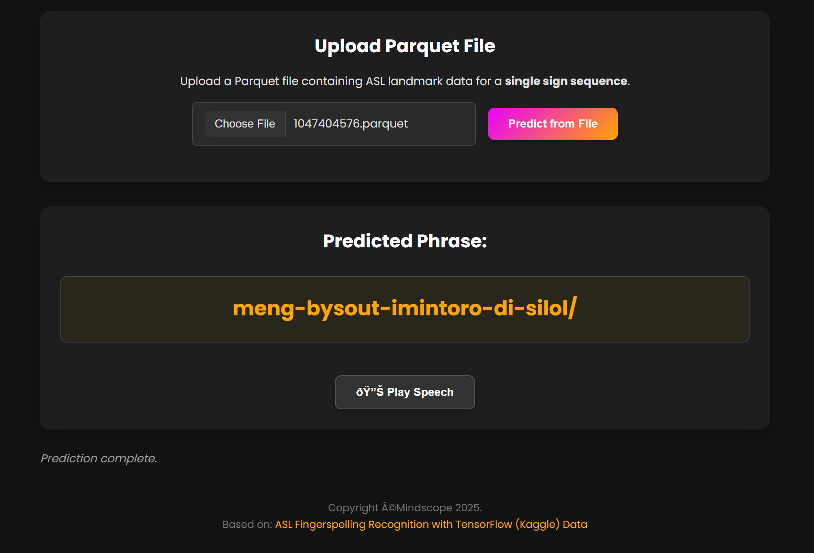

# American Sign Language (ASL) to Speech Conversion System

A web-based system for converting American Sign Language (ASL) fingerspelling gestures to text and speech using machine learning and deep learning. The app supports both file upload (Parquet) and real-time webcam-based recognition, with audio playback using ElevenLabs TTS.

---

## Features
- Upload ASL landmark data (Parquet file) for prediction
- Real-time ASL recognition via webcam (MediaPipe Hands & Pose)
- Converts recognized text to speech (via ElevenLabs API)
- Modern, responsive web UI

---

## Screenshots

### Home Page


### Processing Animation


### Webcam Mode


### Prediction Complete


---

## Setup & Installation

### 1. Clone the repository
```bash
git clone <repo-url>
cd ASL-to-Speech
```

### 2. Create and activate a virtual environment (optional but recommended)
```bash
python -m venv venv
source venv/bin/activate  # On Windows: venv\Scripts\activate
```

### 3. Install dependencies
```bash
pip install -r requirements.txt
```

### 4. Add ElevenLabs API Key (for TTS)
- Create a `.env` file in the project root:
  ```
  ELEVENLABS_API_KEY=your_api_key_here
  ```
- (Optional) You can still use the app without TTS, but audio playback will be disabled.

### 5. Ensure model and data files are present
- Place `model.tflite`, `character_to_prediction_index.json`, and `inference_args.json` in the project root or `data/` directory as required.

---

## Running the App

```bash
uvicorn main:app --reload
```
- Open your browser and go to: [http://localhost:8000](http://localhost:8000)

---

## Usage
- **Upload Mode:** Upload a Parquet file containing ASL landmark data for a single sign sequence.
- **Webcam Mode:** Use your webcam to sign in real time. The app will capture and predict the ASL phrase, then play the audio.

---

## Acknowledgements
- [Kaggle: ASL Fingerspelling Recognition with TensorFlow](https://www.kaggle.com/code/columbia2131/asl-fingerspelling-recognition-w-tensorflow)
- [MediaPipe](https://mediapipe.dev/)
- [ElevenLabs TTS](https://elevenlabs.io/)
- [Unsloth TTS Resources](https://docs.unsloth.ai/basics/text-to-speech-tts-fine-tuning)
- [Orpheus TTS](https://huggingface.co/unsloth/orpheus-3b-0.1-ft-unsloth-bnb-4bit)

---

## License

This project is licensed under the MIT License. See [LICENSE](LICENSE) for details.

---

## Author
Paul Ndirangu